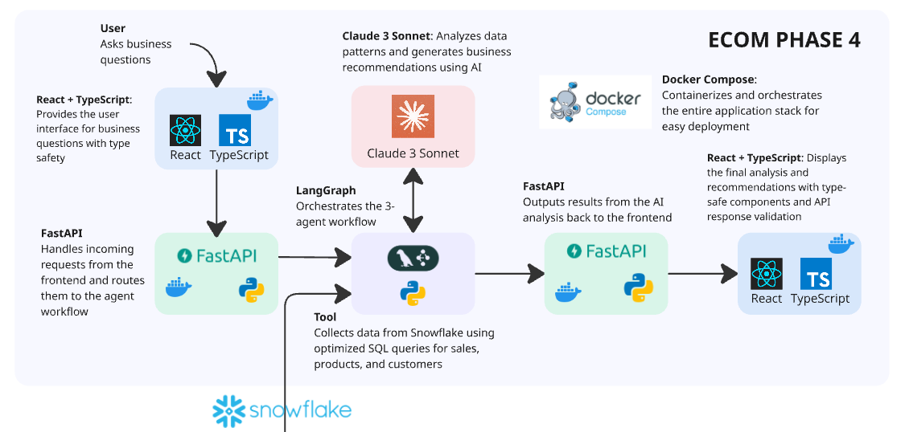

# E-commerce AI Agents

AI agents that actually understand your business data. Built this to stop writing the same queries over and over.


**eCommerce AI Agents Diagram**


**eCommerce End-to-End Diagram**


**Dependencies:** Snowflake + Anthropic API

## What it does

Ask questions about your e-commerce data in plain English, get back analysis + actionable recommendations. No more "let me pull that data for you". Just ask and get answers.

**Example queries:**
- "How are sales trending this month?"
- "Which customer segments should we focus on?"
- "What products are underperforming?"

## Prerequisites

You need [ECOM Phase 1](https://github.com/sclauguico/ecommerce-modern-data-stack) running first. This connects to your Snowflake warehouse with the e-commerce schema.

## Quick Start

1. **Clone and setup:**
```bash
git clone https://github.com/sclauguico/ecom-ai-analyzer.git
cd ecom-ai-analyzer
```

2. **Environment variables:**
```bash
cp .env.example .env
# Edit .env with your credentials
```

3. **Run with Docker:**
```bash
docker-compose up --build
```

4. **Access:**
- Frontend: http://localhost:3000
- API: http://localhost:8000
- Docs: http://localhost:8000/docs

## Architecture

```
User Query → React → FastAPI → LangGraph → Snowflake ↔ Claude → Results
```

**Components:**
- **React Frontend** - Chat interface for queries
- **FastAPI Backend** - REST API handling requests
- **LangGraph** - Orchestrates three AI agents:
  - Data Extractor: Fetches relevant Snowflake data
  - Analyst: Identifies patterns and trends
  - Consultant: Generates business recommendations
- **Claude** - Does the actual analysis
- **Snowflake** - Your data warehouse

## Development

### Local Setup

**Backend:**
```bash
python -m venv venv
venv\Scripts\activate # mac: source venv/bin/activate
pip install -r requirements.txt
python backend/main.py
```

**Frontend:**
```bash
cd frontend
npm install
npm start
```

### Testing

```bash
# Test Snowflake connection
python backend/test_snowflake.py

# Test API endpoints
curl http://localhost:8000/health
curl http://localhost:8000/quick-insights

# Test analysis
curl -X POST http://localhost:8000/analyze \
  -H "Content-Type: application/json" \
  -d '{"query": "How are our sales trends?"}'
```

## Configuration

### Environment Variables

```bash
# Snowflake (required)
SNOWFLAKE_USER=your_user
SNOWFLAKE_PASSWORD=your_password
SNOWFLAKE_ACCOUNT=your_account
SNOWFLAKE_WAREHOUSE=your_warehouse
SNOWFLAKE_DATABASE=your_database
SNOWFLAKE_RAW_SCHEMA=your_schema
SNOWFLAKE_ROLE=your_role

# Anthropic (required)
ANTHROPIC_API_KEY=your_api_key
```

### Expected Data Schema

The agents expect these tables in your Snowflake schema:
- `ORDERS` - order data with customer_id, total_amount, status
- `ORDER_ITEMS` - line items with product_id, quantity, unit_price
- `PRODUCTS` - product catalog with names and categories
- `CUSTOMERS` - customer data with email and signup info

## API Endpoints

| Endpoint | Method | Description |
|----------|--------|-------------|
| `/health` | GET | Service health check |
| `/quick-insights` | GET | Dashboard metrics |
| `/analyze` | POST | Submit analysis query |
| `/docs` | GET | API documentation |

## Deployment

### Docker (Recommended)

```bash
# Production
docker-compose up -d

# View logs
docker-compose logs -f

# Stop
docker-compose down
```

### Manual

Requires Python 3.11+, Node 18+, and environment setup.

## Troubleshooting

**"Module not found" errors:**
- Check your Python path and virtual environment
- Make sure all dependencies are installed

**Snowflake connection issues:**
- Verify credentials in .env file
- Check if warehouse is running
- Test with `python backend/test_snowflake.py`

**Frontend won't start:**
- Delete node_modules and reinstall: `rm -rf node_modules && npm install`
- Check if port 3000 is available

**API errors:**
- Check logs: `docker-compose logs backend`
- Verify Anthropic API key is valid
- Make sure Snowflake has data

## Contributing

1. Fork it
2. Create feature branch (`git checkout -b feature/amazing-feature`)
3. Commit changes (`git commit -m 'Add amazing feature'`)
4. Push to branch (`git push origin feature/amazing-feature`)
5. Open a Pull Request

## Tech Stack

- **Backend:** Python, FastAPI, LangGraph, Snowflake connector
- **Frontend:** React, TypeScript, Axios
- **AI:** Anthropic Claude
- **Data:** Snowflake
- **Deployment:** Docker, Docker Compose

## Demonstration Video

Please refer to this [link](https://www.canva.com/design/DAGtCKZSQPY/YCCzIVhRFR86yIf5VVBC9A/watch?utm_content=DAGtCKZSQPY&utm_campaign=designshare&utm_medium=link2&utm_source=uniquelinks&utlId=hfe48710daa)

## Related Projects

- [ECOM Phase 1](https://github.com/sclauguico/ecommerce-modern-data-stack) - Data pipeline foundation

## Acknowledgments

Big thanks to the amazing educators who made this project possible:

- **[Ed Donner](https://www.udemy.com/user/ed-donner-3/)** - For the excellent LLM Engg and AI Agents coursess
- **[freeCodeCamp with Vaibhav Mehra](https://www.youtube.com/watch?v=jGg_1h0qzaM)** - For making LangGraph intuitive
- **[Tech with Tim](https://www.youtube.com/watch?v=13tMEW8r6C0&list=WL&index=28&t=1168s)** - For the React + FastAPI integration
- **[Krish Naik](https://www.youtube.com/@krishnaik06)** - For all the awesome end-to-end projects